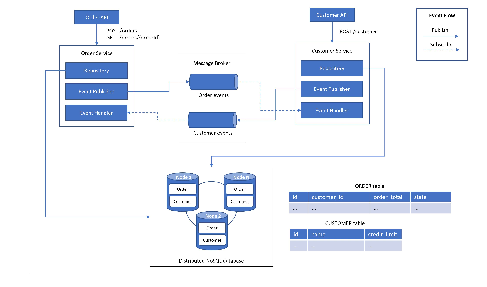
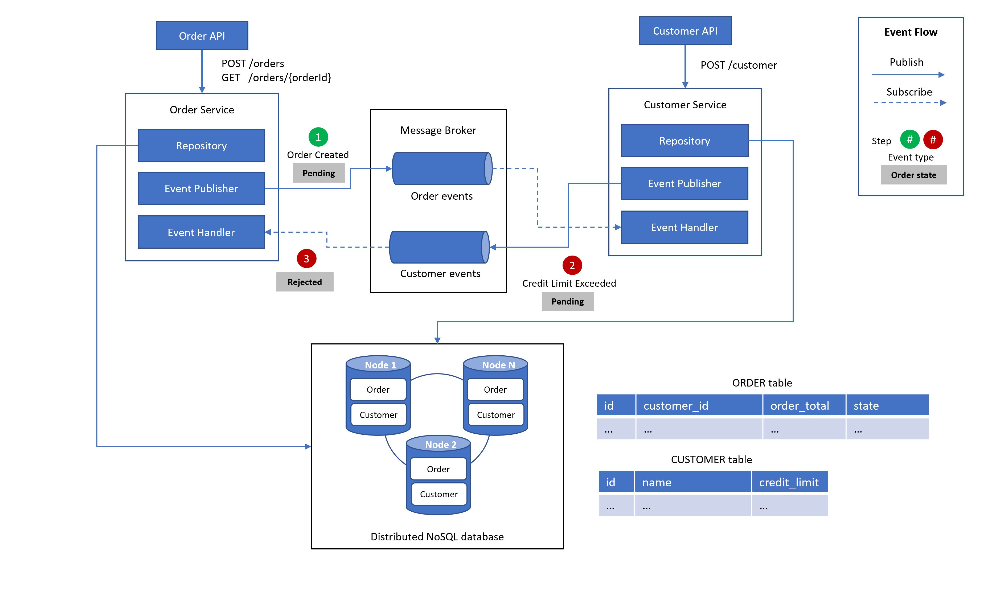

# Choreography-based Saga Pattern: Data consistency in Microservices

This is a transaction management sample solution that demonstrates how to maintain data consistency across services in a microservices architecture by using [Saga](https://microservices.io/patterns/data/saga.html) pattern.

Services are implemented through choreography-based sagas, which means that all participants are loosely coupled as they don't have direct knowledge of each other. Participants 'simply' subscribe to each other’s events and respond accordingly.

## Architecture Overview


### Architecture Components

- The `Order API` is a Java/Spring Boot RESTful service with routes to create a new order and get details of an existing order.

- The  `Order Service` is a saga participant written in Java/Spring Boot that receives requests from the Order API. It starts local transactions with a distributed database (Datastax Cassandra) to create a new order or query info about an existing order. After the creation of these local transactions, it publishes order events to the message broker (Apache Kafka). Additionally, there is an event handler that subscribes to a `Customer Topic` to receive customer events.

- The `Customer API` is a Java/Spring Boot RESTful service with a route to create a new customer.

- The  `Customer Service` is a saga participant written in Java/Spring Boot that receives requests from the Customer API. It starts local transactions with a distributed database (Datastax Cassandra) to create a new customer. After the creation of these local transactions, it publishes customer events to the message broker (Apache Kafka). Additionally, there is an event handler that subscribes to an `Order Topic` to receive order events.

### Architecture Notes 

- It is not mandatory to use a highly scalable distributed NoSQL database (like Datastax Cassandra) for local transactions for each saga participant, you can use a SQL or NoSQL database of your choice.

- It is not mandatory to use Apache Kafka as a message broker, you can use another one of your choice (like RabbitMQ, Azure Event Hub, etc).

## Architecture: A Successful Scenario


1. The `Order Service` creates an `Order` in a **PENDING** state and publishes an `OrderCreated` event.

2. The `Customer Service` receives the `OrderCreated` event and attempts to reserve credit for that order. It publishes a `CreditReserved` event and the order state is still **PENDING**.

3. The `Order Service` receives the `CreditReceived` event and changes the order state to **APPROVED**.

## Architecture: A Failure Scenario



1. The `Order Service` creates an `Order` in a **PENDING** state and publishes an `OrderCreated` event.

2. The `Customer Service` receives the `OrderCreated` event and attempts to reserve credit for that order. It publishes a `CreditLimitExceeded` event and the order state is still **PENDING**.

3. The `Order Service` receives the `CreditLimitExceeded` event and changes the order state to **REJECTED**.

## Getting Started: Prerequisites

- Java 8 (OpenJDK or Oracle JDK)
- Docker for Windows or Linux

## Building and Running: Order services

Go to `src/order` and build the application:

```
./gradlew assemble
```

Note: you do not need to install Gradle since it will be downloaded automatically, you just need to have Java 8 installed.

Run the application:

```
./gradlew build && java -jar order-api/build/libs/order-api-0.1.0.jar
```

Next you can use the Order API through Swagger UI on `http://localhost:8080/swagger-ui.html`.

## References

- [Book: Microservices Patterns](https://www.manning.com/books/microservices-patterns)
- [microXchg 2018: Managing data consistency in a microservice architecture using Sagas](https://www.youtube.com/watch?v=7dy5WPSv2DQ)
- [Eventuate Tram Customers and Orders](https://github.com/eventuate-tram/eventuate-tram-examples-customers-and-orders)
